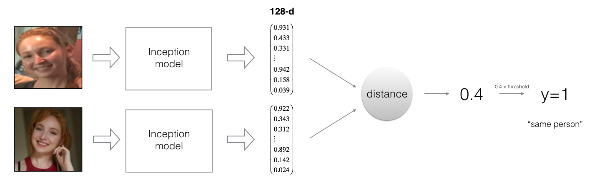

# Face Detection using Deep Convolutional Neural Networks
Face recognition problems commonly fall into two categories: 

- **Face Verification** - "is this the claimed person?". For example, at some airports, you can pass through customs by letting a system scan your passport and then verifying that you (the person carrying the passport) are the correct person. A mobile phone that unlocks using your face is also using face verification. This is a 1:1 matching problem. 
- **Face Recognition** - "who is this person?". For example, the video lecture showed a face recognition video (https://www.youtube.com/watch?v=wr4rx0Spihs) of Baidu employees entering the office without needing to otherwise identify themselves. This is a 1:K matching problem. 

FaceNet learns a neural network that encodes a face image into a vector of 128 numbers. By comparing two such vectors, we can then determine if two pictures are of the same person.
    
**In this project, I will:**
- Implement the triplet loss function
- Use a pretrained model to map face images into 128-dimensional encodings
- Use these encodings to perform face verification and face recognition

## Naive Face Verification

In Face Verification, you're given two images and you have to tell if they are of the same person. The simplest way to do this is to compare the two images pixel-by-pixel. If the distance between the raw images are less than a chosen threshold, it may be the same person! 

<caption>
 <u>  </u>
</caption>

Of course, this algorithm performs really poorly, since the pixel values change dramatically due to variations in lighting, orientation of the person's face, even minor changes in head position, and so on. 

You'll see that rather than using the raw image, you can learn an encoding f(img) so that element-wise comparisons of this encoding gives more accurate judgements as to whether two pictures are of the same person.

## FaceNet
By using a 128-neuron fully connected layer as its last layer, the model ensures that the output is an encoding vector of size 128. I then use the encodings the compare two face images as follows:

<caption>
 <u>    </u>  By computing a distance between two encodings and thresholding, I can determine if the two pictures represent the same person
</caption>

So, an encoding is a good one if: 
- The encodings of two images of the same person are quite similar to each other 
- The encodings of two images of different persons are very different

The triplet loss function formalizes this, and tries to "push" the encodings of two images of the same person (Anchor and Positive) closer together, while "pulling" the encodings of two images of different persons (Anchor, Negative) further apart. 

 
<caption>
 <u>    </u>   
</caption>